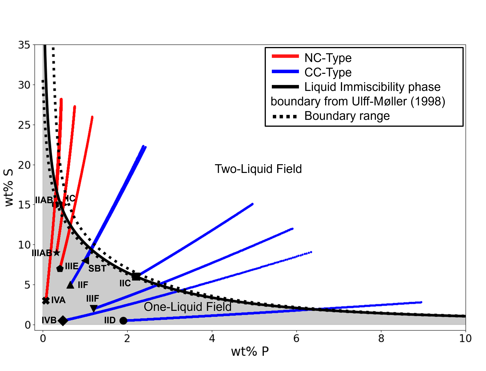

# Iron Meteorite Liquid Immiscibility Fractional Crystallization Model
This code models fractional crystallization in iron meteorites accounting for the onset of liquid immiscibility.

## Background
Iron meteorites are organized into groups based on their metallic compositions. Elemental trends suggest that 
meteorites within the same "magmatic" group originate from the same crystallized planetesimal core.
However, 20% of iron meteorites in the Meteoritical Bulletin Database are considered ungrouped, leaving
questions about what these ungrouped irons represent.

Current efforts to model elemental trends in magmatic iron groups use the simplifying assumption 
that only one liquid is present throughout the crystallization process. 
While this simplified model can reproduce trends observed in some groups, it is not physically realistic. 
All magmatic groups are expected to encounter liquid immiscibility (Fig. 1), thus, including it in the crystallization
model can drastically impact core crystallization evolution and potentially address open questions
about currently ungrouped meteorites.

*Figure 1: Most of the iron meteorite groups have initial sulfur and phosphorus concentrations that begin in the 
shaded one-liquid field. As the concentration evolves during crystallization, all groups will eventually cross the black
phase boundary [6] into the two-liquid field.*

For more detailed information about the model and results, see [paper ref](paper_link). **TODO: ADD PAPER REF**

## Dependencies
- Python3
- **TODO: ADD table of python libraries and versions**

## Installation and Execution
Conda is recommended for setting up a unique virtual environment to contain this program's dependencies. To install conda,
visit [Conda Docs](https://docs.conda.io/projects/conda/en/latest/user-guide/install/index.html).

Download the repository or clone with `git clone https://gitlab.jhuapl.edu/glantak1/fractionalcrystallization.git`

In a terminal,
1. Make a python environment from the environment.yml file with `conda env create -f environment.yml`
2. Activate your environment with `conda activate Iron_Meteorites`
3. Navigate to your local installation of this repository with `cd /path/to/fractionalcrystallization`
4. Execute the `run_crystallization` script from the command line with `python -m model.run_crystallization <args>`

Or configure your favorite python IDE to execute the scripts.

## File Descriptions

### Data Files 
- `IronMeteorites.xlsx`: Published meteorite compositions in each group.

- `parameterization_coeff_lookup.csv`: Published partition coefficients (D) and $\beta$ constants for 25 elements [2,3,4].

- `start_comp_lookup_default.csv`: Published starting concentrations for each group [1].

- `start_comp_lookup_experiment.csv`: Altered starting concentrations that fit the data better with this model.

### Model Files 

#### Main Model
`run_crystallization.py`: This script executes the crystallization model for the given inputs and is what you should actually run. 
Arguments include:

| Argument    | Type      | Default  | Description                                                      |
|:------------|:----------|:---------|:-----------------------------------------------------------------|
| `element`   | `string`  | Required | trace element symbol (ex. As for arsenic)                        |
| `LM0`       | `float`   | Required | starting concentration of the trace element in the liquid        |
| `unit`      | `string`  | Required | unit of measurement for LM0 (ppm, ug/g, mg/g, wt%, ppb, or ng/g) |
| `LMS0`      | `float`   | Required | starting concentration of sulfur (wt%) in the liquid             |
| `LMP0`      | `float`   | Required | starting concentration of phosphorous (wt%) in the liquid        |
| `LMNi0`     | `float`   | Required | starting concentration of nickel (wt%) in the liquid             |
| `f0`        | `float`   | 0.0005   | initial crystallization step size                                |
| `save_data` | `boolean` | True     | exports model data to excel spreadsheet                          |
| `run_case`  | `integer` | 1        | model run case (0, 1, 2, or 3)                                   |

The different `run_case` options are:
- 0: model runs discounting liquid immiscibility
- 1: model runs accounting for two-liquid immiscibility, crystallizing from both liquids and assuming the liquids are in equilibrium
- 2: model accounts for liquid immiscibility, crystallizing only from the S-rich liquid
- 3: model accounts for liquid immiscibility, crystallizing only from the P-rich liquid

`fractional_crystallization_stages.py`: This script is the algorithm that models crystallization, containing the logic to run
both the one and two liquid stages. 

#### Support Scripts
- `functions.py` and `chemistry.py` contain relevant equations and support functions used throughout the model
- `parameters.py` initializes the relevant coefficients 
- `state.py` tracks and records the state of the model and format data to be exported

## Jupyter Notebook
We include a graphical interface in the form of a jupyter notebook that employs user-friendly, interactive widgets
to execute and explore the model results. 

To deploy the notebook, **TODO: ADD DEPLOY INSTRUCTIONS**

For a user guide, see `docs/Fractional Crystallization Notebook User Guide.pdf`

## References
1. Zhang, B., Chabot, N. L., & Rubin, A. E. (2024). Compositions of iron-meteorite parent bodies constrain the structure of the protoplanetary disk. Proceedings of the National Academy of Sciences, 121(23), e2306995121.
   * Meteorite composition data found for IC, IIAB, IIIAB, IVA, and IIIE found in Appendix Table S2.
   * One liquid model-derived bulk compositions for IC, IIAB, IIIAB, IVA, and IIIE in Appendix Table S4
2. Chabot, N. L., Cueva, R. H., Beck, A. W., & Ash, R. D. (2020). Experimental partitioning of trace elements into schreibersite with applications to IIG iron meteorites. Meteoritics & planetary science, 55(4), 726-743.
   * D_schreibersite values found Table 3, *Calculated* column (values used in model in  parameterization_coeff_lookup.csv)
3. Chabot, N. L., Hamill, C. D., Shread, E. E., Ash, R. D., & Corrigan, C. M. (2025). An experimental study of trace element partitioning into troilite during iron meteorite crystallization. Meteoritics & Planetary Science, 60(5), 1048-1062.
   * D_troilite values found in Table 2, *solid metal/troilite* column (values used in model in parameterization_coeff_lookup.csv)
5. Chabot, N. L., Wollack, E. A., McDonough, W. F., Ash, R. D., & Saslow, S. A. (2017). Experimental determination of partitioning in the Fe‐Ni system for applications to modeling meteoritic metals. Meteoritics & planetary science, 52(6), 1133-1145.
   * Parameterization coefficients for each element in Table 2 (values used in model in parameterization_coeff_lookup.csv)
6. ULFF‐MØLLER, F. I. N. N. (1998). Effects of liquid immiscibility on trace element fractionation in magmatic iron meteorites: A case study of group IIIAB. Meteoritics & Planetary Science, 33(2), 207-220.
   * Liquid immiscibility fractional crystallization model and phase boundary equations

## Acknowledgements
This work was supported by the NASA Emerging Worlds Program grant 80NSSC19K1613 to N.L. Chabot.

## Citation

## License